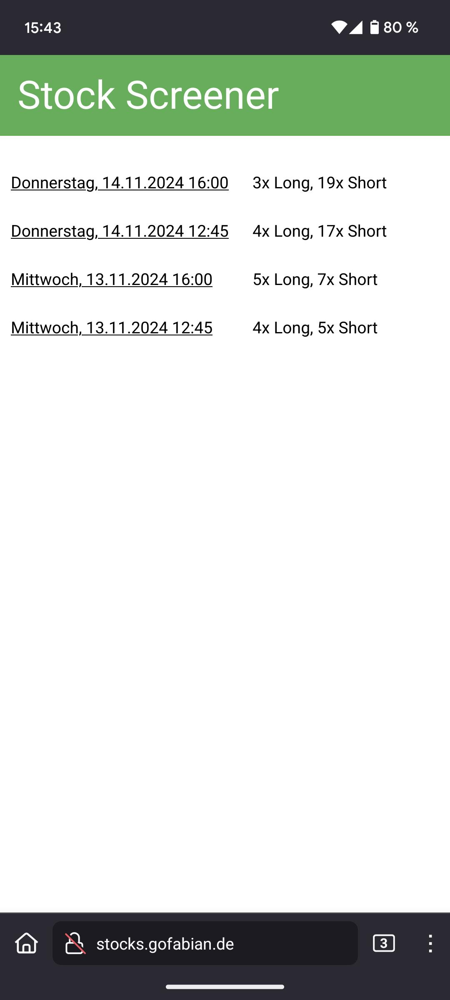
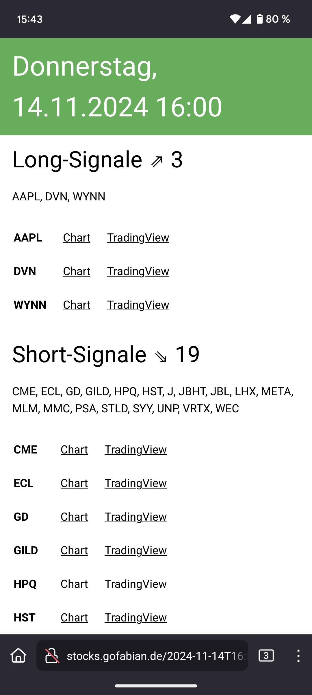
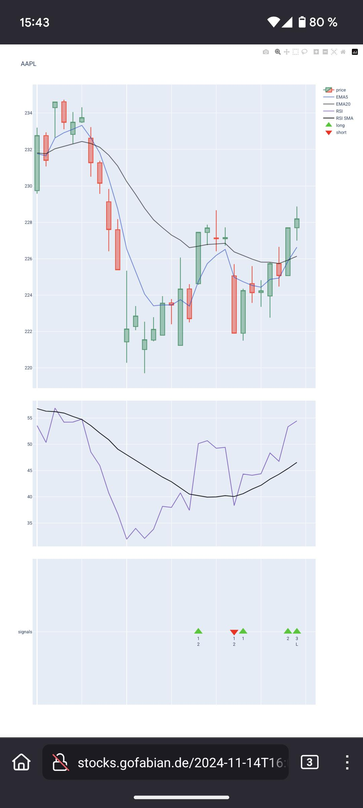

# Stock Screener

Scans charts of S&P 500 stocks for short and long signals according to PJM training.

## Generated website

  

## Structure

`/docs/`: generated website

`/templates/`: html templates

`/build.py`: build script

`/finance.py`: generation logic

`/main.py`: demo runner

`/stocks.py`: list of S&P stocks to be scanned

## todos

- filter cache by requested start/end
- check for na values
- write raw.json for each report
- timezones!?!?!
- holidays
- bis jetzt nachgenerieren, nicht nächstes vermutetes
